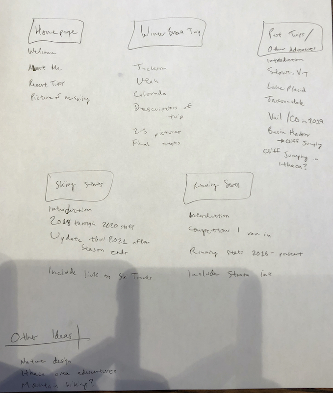
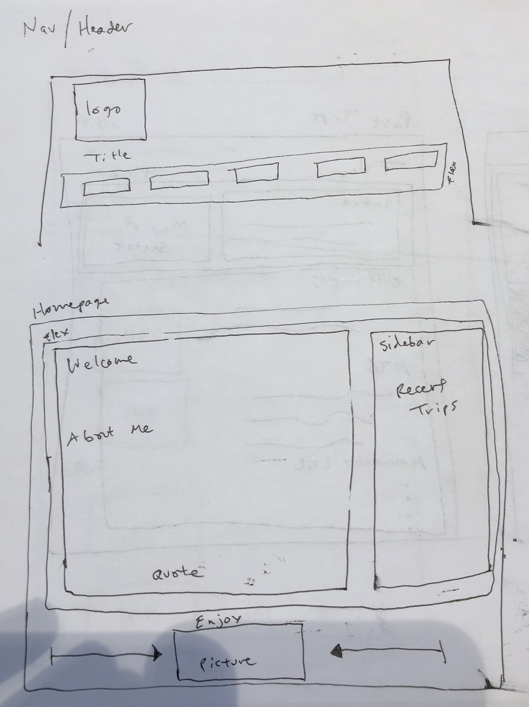
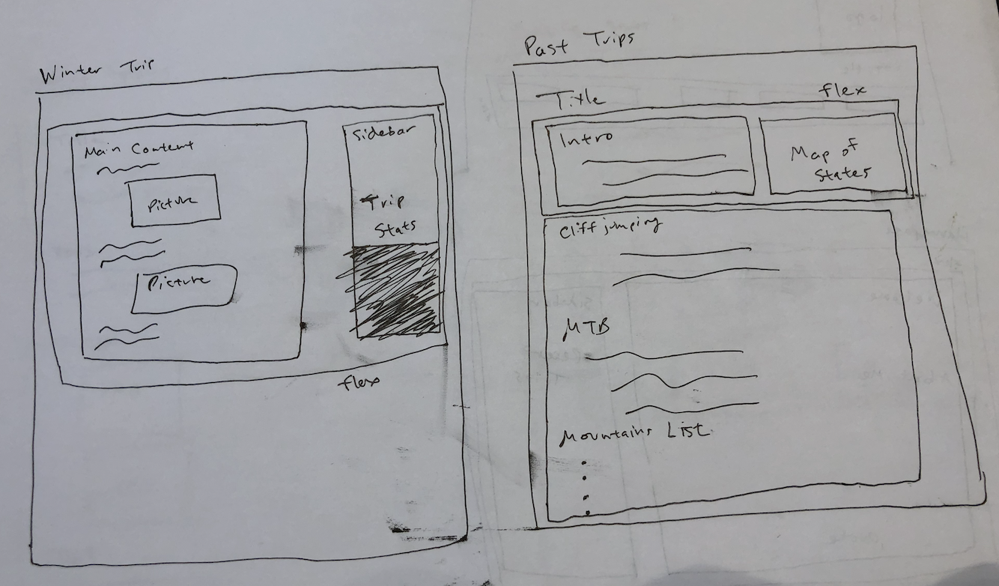
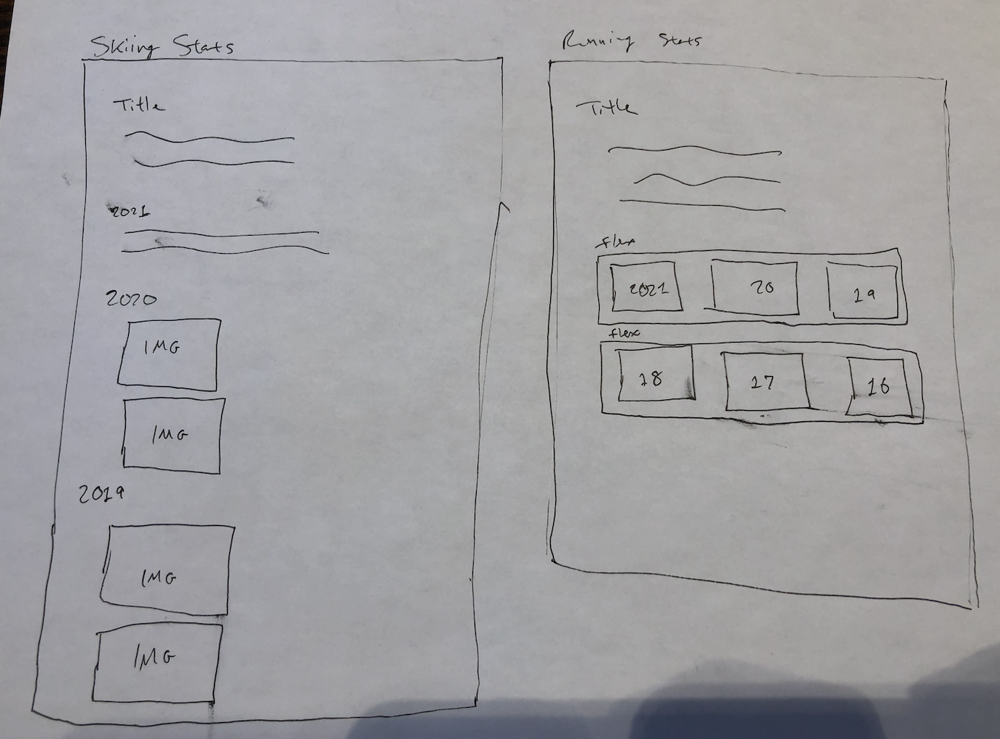

# Project 1: Design Journey

**For each milestone, complete only the sections that are labeled with that milestone.**

Be clear and concise in your writing. Bullets points are encouraged.

**Everything, including images, must be visible in Markdown Preview.** If it's not visible in Markdown Preview, then we won't grade it. We won't give you partial credit either. This is your warning.

## Audience & Content

**Make the case for your decisions using concepts from class, as well as other design principles, theories, examples, and cases from outside of class.**

You can use bullet points and lists, or full paragraphs, or a combo, whichever is appropriate. The writing should be solid draft quality but doesn't have to be fancy.

**No sketches are required for Milestone 1.**

### Website Topic (Milestone 1)
> Briefly explain what your website will be about.

My website will be a personal website about adventures I've gone on and statistics/data I've collected along the way, specifically while skiing, hiking, running, biking, etc. The primary focus will be on skiing adventures and include data going back at least 3 years.

### Audience (Milestone 1)
> Briefly explain who the intended audience(s) is for your website. Be specific and justify why this audience is appropriate for your site's topic.

The intended audience is my family and friends who are outdoors enthusiasts, as they would be most interested in both learning about some of the trips I've gone on as well as replicating some of those trips for themselves.

### Final Content (Milestone 1)
> Briefly describe the content you plan to include in the final site, and why it's the right content for your audiences.

I will include data that I've collected within the Ski Tracks app, Strava app, and MapMyRide/Run apps. I'll also include images and possibly videos of different trips and showing the cool places I've visited and experienced.

### Home Page Content (Milestone 1)
> Briefly identify what content you will include on the homepage and why this content should be the first thing your target audience sees when they visit your site.

My homepage will include an introduction, about me section, a recent trips section, and an image of me skiing. This content gives the audience a glance of the rest of the content found on the website, which will go into significantly more detail. I also want to include the introduction and about me sections to specifically identify with my targeted audience.

## Information Architecture

**Make the case for your decisions using concepts from class, as well as other design principles, theories, examples, and cases from outside of class.**

Each section is probably around 1 reasonably sized paragraph (2-4 sentences).

**No sketches are required for Milestone 2.**

### Audience (Milestone 2)
> A clearer description of audience: who are they, what are they interested in with respect to this site, and what are the design goals for that audience.

The audience is specifically members of my family who are interested in learning about the outdoor trips and adventures I've been on, especially since I come from a family who love math and statistics. It's difficult to quantify some of my stories without the stats and data in front of me, but this website allows me to demonstrate different statistics to match with the cool stories I want to share with them. The same goes for my friends who love the outdoors, math, and exploring - this site provides them a resource to learn about and possibly replicate some of the cool trips I've been on. The design goal is a simple website, well spaced out and well organized, with a nature theme for the colors.

### Organization & Navigation (Milestone 2)
> A description of how you generated and considered alternatives for the site's content organization and navigation. You are required to include images here of your card sorting for determining the organization of content and the navigation.

> Thoroughly document this process. The _process_ is the important part of this assignment, not the final result.]

The site's content was organized into five main pages, although I originally considered more I did not want to overwhelm viewers or create a large number of pages with little content. I settled on the homepage, my winter break trip from 2021, past trips and adventures, a page for my ski tracking stats, and a page for my running stats. I organized all the content I wanted to include within those pages, and while I still have more content I'd like to include potentially, I wanted to create a very organized draft of the site for milestone 2. For example, I'm considering including mountain biking trips and perhaps a cliff jumping specific page. I decided to put my winter break trip as its own page rather than include it on the past trips page because of its importance and length as well. It deserves its own page of emphasis since it is much more significant than any of the other trips I plan to include on the past trips page.

### Final Organization and Navigation (Milestone 2)
> Explain how the final organization of content and navigation is appropriate for your target audiences.

The final organization of my site allows users to distinguish between the two overarching themes of the site - specific trips and adventures I've completed, and the statistics of the different activities I like to attract. This way, someone interested in just the cool adventures does not have to scroll through a lot of data and numbers to find the stories that match the data, and vice versa for those interested in just the data. I want to tell a story with the winter break trip page as well, so I include a long detailed breakdown with images of that trip since many outdoors-y people consider a cross country trip in their lifetime.

## Visual Design

**Make the case for your decisions using concepts from class, as well as other design principles, theories, examples, and cases from outside of class.**

Remember to focus on the things we can't see just by looking at the site: changes, alternatives considered, processes, and justifications.

Each section is probably around 1 reasonably sized paragraph (2-4 sentences).

### Theme Ideas (Milestone 3)
> Discuss several ideas about styling your site's theme. Explain why the theme ideas are appropriate for your target audiences. Feel free to include some hand-drawn sketches (not digital drawings, not mock-ups, not wireframes, etc.) here to document your design process.

The second theme I picked is a bit more rigid with the empahsis being on creating a presentable website that is inviting to all. None of the main colors are too bright, but rather a very soft blend of outdoorsy colors (grey, dark blue, dark green). My initial plan for this theme was to use a variety of font styles rather than colors, but after a few attempts I realized the most user-friendly format was best utilized with using a color scheme and a quiet theme for the rest of the site.

For the first theme, I wanted to create a more vibrant and more outdoors-themed color scheme, which is why the background is a tree green and the font colors contrast it well so that readability and usability are not affected at all. I personally think my first theme is probably the one I would want to go with to give my audience the most inviting sense while viewing the site. It uses sans-serif fonts rather than serif font like my first site, thereby creating a less intense appearance and hopefully enticing the audience to explore multiple pages of the site and learn about some of the cool trips and adventures I've been on.

### Theme Design (Milestone 3)
> Discuss your theme designs: how did you come to them, what are their strengths and weaknesses, how do they fit your overall design goals and audiences?

> Emotion is a big part of design. What emotions where you thinking about or trying to convey in your designs?

Both of my themes I wanted to use the colors green and blue to some degree to emphasize the outdoors adventures theme of the website. Additionally both of those colors represent emotions of relaxation, nature, trust, competence, and balance according to graphic design color wheels. These are some of the primary emotions I want my audience to feel to best connect with the content on my site when they first glance at it. I did not want the theme to have extremely eye-popping colors that detracted from the rest of the site's content. I wanted to portray exciting content but with a peaceful and nature-filled emotional experience, so both themes that I designed tried to fulfill that without overreaching into a too exciting and too distracting theme.

## Rationale

**This rationale should be polished writing: one you might submit as a report to a client or boss to help explain the project and convince them you did a good job. You'll be surprised how much writing and communicating you need to do about projects and choices on internships and jobs; practice that here.**

It should be a comprehensive, complete story of the project. You might find that each section runs a few paragraphs (1-2). Sketches can often help tell the story of your design. Screenshots are also useful for describing issues discovered during the design process and how you addressed them.

**All images must be visible in Markdown Preview for credit!**

Your rationale should be a polished version of the earlier explanations.

### Site Layout (Final Submission)
> Show your design process and final layout for your site. You must include photos of your sketches of the layout. No digital drawings permitted.

> You must label each figure and provide an explanation of the sketch.

As described below, my navigation bar is a key part to the website as it's the initial thing the audience sees and also generates their flow throughout the website. I wanted a very clean and appealing header and nav bar, so I used a flexbox of horizontal boxes rather than bullet points. The site title and logo are also other key identifiers that give users a first impression of the site - outdoors and adventure themed, plus a simple and clean look.

My homepage was important because it describes the rest of the site. I did not want long blocky text to dissuade readers from continuing throughout the website, so I tried to the paragraphs small and include a flexbox that divided the sidebar and the maincontent. At the bottom of the page, to ensure that the layout did not feel clunky or forced, I centered the final section of an image of me ski racing. I also centered the entire layout to give the site breathing room and negative space to emphasize the simple theme powered by cool and inspiring content.

The winter trip page is the most text heavy webpage on the site, so I split it up into a few sections. First, I used a flexbox to divide between the main story and a sidebar, which I used to give a brief overview and reiterate my passion for data keeping. Whether the reader looks at the sidebar first or not is not too important, but it does give them the option to look at an overview and then dive into the story. The story is split up chronologically with two images to not overwhelm the reader with long paragraphs, and additionally to give visual representation to certain parts of the trip.

The past trips page includes some of the various activities I've done, but it starts with an overview of my bigger goals and accomplishments, specifically how many states and countries I've visited. To give the webpage a bit more intentional space and organization, I included a visual of the states I've visited next to the intro paragraph, dividing the two with a flexbox. The rest of the page is split up by outdoor sports category, followed by a list of the mountains I've skied at. The list of mountains is a cool addition because it builds off of/leads into my ski stats page, where you can see specific details of mountains I've skied at. The page is organized very intentionally with important details for the audience members to learn about my experiences and also replicate if desired.

My ski stats page begins with an introduction followed by the specific statistics for the past 2 (technically 3) years of skiing. I included the data as images because of its organization in excel. I do not know how to input tables or style them specifically, and I felt that these tables and graphs provided the best visuals for the audience. This page is driven by the data I've collected rather than the story I've told, which is why it is organized into its own page rather than on some of the other pages on the site.

The running stats page is similar to the skiing stats page, but because the statistics are organized into annual totals rather than individual runs, I created a box for each year. After the introduction and explanation of how I track running for those interested, I utilized two flex boxes to best organized the data on the page. Each flexbox is a row with three boxes of annual data, and it is a much more visually appealing way to read data rather than in a long bulleted list vertically. I also included a background color for each box, matching the background colors of some of the sidebars on the site for theme consistency, to very clearly delineate between each year and again utilize negative space in the design.

### Audience (Final Submission)
> A complete and polished description of the intended audience(s) for your website.

My audience can be divided into three groups - my direct friends, my extended family, and finally other outdoorsmen who are interested in reading about trips and adventures I've gone on to compare and perhaps replicate them. The vast majority of my friends have similar interests as me, especially with regards to skiing and doing outdoor activities. To appeal to my family, I include lots of details about trips they may have only seen pictures from, as well as statistics since many of my family members enjoy math and stats. I credit my family with my drive to track most of the outdoors activities I participate in, and this site provides them with visual representation of their influence on my life. To appeal to both my friends as well as other outdoorsy individuals, both of whom I can easily identify with, I tried to include as many details regarding trips and lists of places I've visited so that they too can check out those places and go on similar adventures.

### Design Goals (Final Submission)
> An explanation of the design goals for that audience, based on your earlier rationales.

My audience can view some of the crazy things I've done, and on certain pages see some of the specific details of trips and locations, implying that they should also focus on seeing some of those cool places and mountains. Additionally, the statistics provide a tangible reference point for the difficulty, the time required, and the explorative nature of many of the journeys and adventures. For all three groups, I want the audience to flow through all of the content with high retention, easy usability, and with a clear sense of nature and the outdoors, which is why my site design focuses on simplicity, organization, and nature theme colors (primarily blue, green, and white - just like forrests, the oceans, and snow) while the rest of the content speaks for itself. The site is both informative and a learning resource for all three groups, and it is designed without any specific order after the homepage. The audience can freely visit each page without needing to have viewed a different one first, which contributes to the website's overall usability and friendliness.

### Navigation (Final Submission)
> An explanation of how the final navigation met your goals and why its appropriate for your audience(s).

The final navigation uses a clean horizontal navigation bar that I modified using a flexbox and inline blocks. Additionally, I linked the website name to always navigate back to the homepage, as well as linking the site's logo (my personal logo of my initials that I designed in photoshop when I was younger) back to the homepage. This gives users more flexibility to return to the homepage, and the rest of the navigation bar is a much more appealing and simplistic design as a series of horizontal boxes with style rather than a list of bullet points linked to each webpage. It allows the audience to follow the flow of the website easily and without detracting from the goal of a simple design. Nature is simple, and so should navigating my website.

### Organization (Final Submission)
> An explanation of how the final organization met your goals and why its appropriate for your audience(s).

The design goal was for a simple website with lots of organization and spacing. My site's final design achieves that through a theme of colors that blend well and are all easily relatable to nature (different shades of green and blue). On some of the pages, I utilized flexboxes to create sidebars that highlight specific things the audience may be interested in, while the main content of the pages all flow well with each page's respective theme. The sidebars also help with organization, highlighted in a slightly different color to emphasize their difference from the main content and leaving the site with a clean appearance.

### Visual Design (Final Submission)
> An explanation of how the final design met your goals and why its appropriate for your audience(s).

My final design was very organized and visually appealing in my opinion. I did not want a large dump of text anywhere on the site as I think people will quickly get bored of reading long paragraphs, so I tried to split up the site into five clear sections. Within each page I wanted a consistent theme with regards to colors and organization, and I felt like my use of flexboxes, consistent font colors, styles, and sizes, plus my use of images did a good job of creating a breathable webpage for all three sub-groups of my target audience to enjoy the website with ease. There site is no overly complicated, so the content is not disregarded because of a poor user interface or organization.

### Self-Reflection (Final Submission)
> What did you learn from this assignment? What are some of your strengths and weaknesses?

The most valuable thing I learned from this assignment I believe was styling and flexboxes. To me, user experience is the most important part of a website, because anyone can create an html site without too much trouble but if the theme and styling is boring and bulky, the audience will often skim through the site and not take in much of the content. I think my strengths were the site's organization and use of both spacing and colors that blended well with the site's nature/outdoors theme. I do think that my skiing stats page is my greatest weakness, however, as I used screenshots of excel tables rather than embedded tables and graphs for the data. I would really like to learn how to input visually appealing tables and graphs into the webpage, and even better interactive tables that allows audience members with a passion for stats to sort and filter data as they please - giving the audience member the power to use the site rather than me telling/showing them the data.
